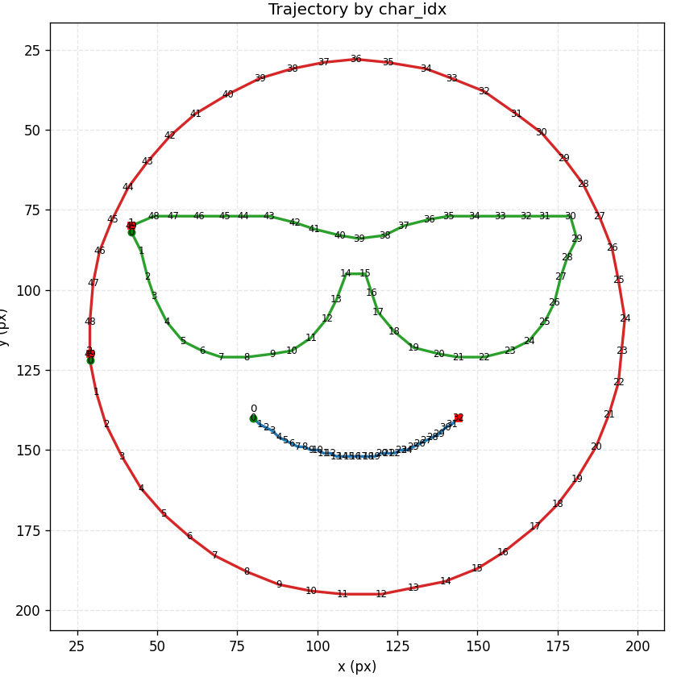
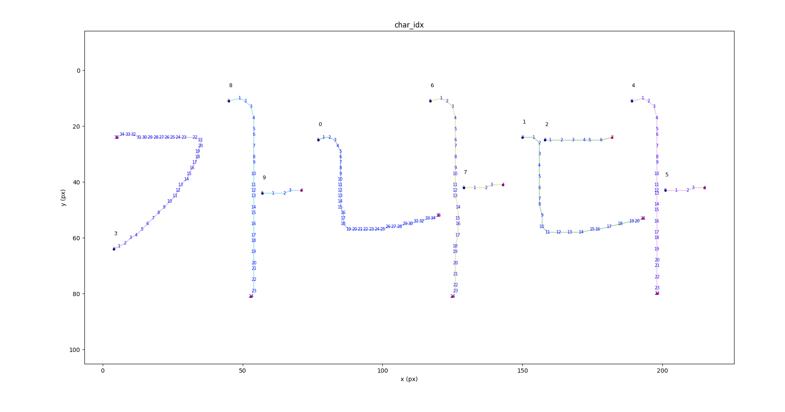
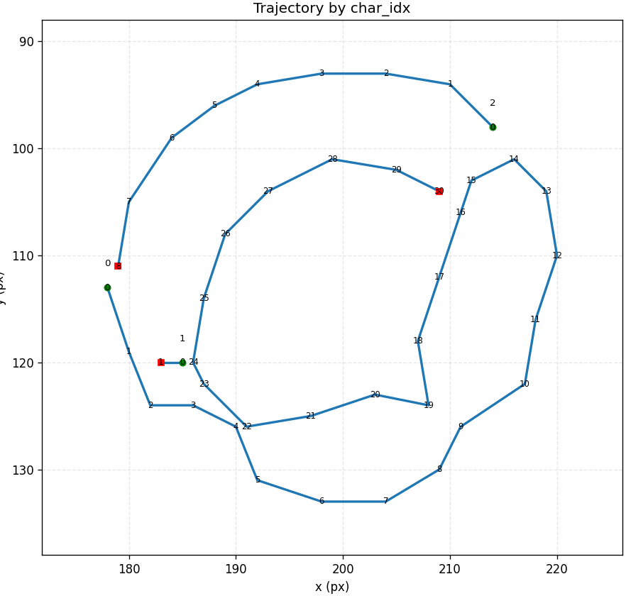
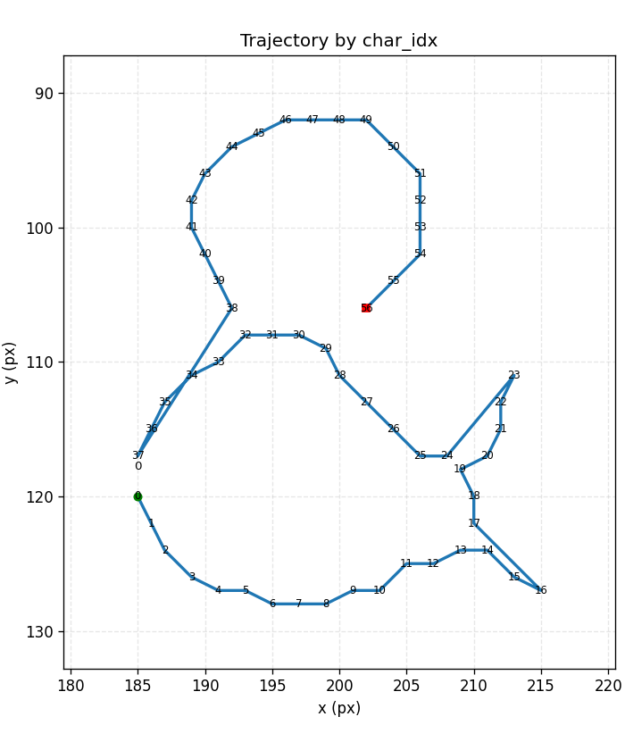

# 🧠 Multi-Character Trajectory Extractor (final\_project)

> A pipeline based on skeletonization for extracting equidistant 3D trajectories along the centerlines of characters.

## 🔍 Project Overview

This project is a Python-based module that extracts the centerline of **multiple characters or symbols** in an image and generates **(x, y, z)**-formatted **equidistant trajectories** for each one.

* Applicable to **handwriting robots**, **domino path design**, **handwriting reproduction**, **pen-pressure-based handwriting analysis**, and more.
* Can be integrated with external systems like ROS2, MoveIt2, GAN-based interpolators, etc.

---

## 🗂️ Directory Structure

```
project_root/
├── extractor/                         # Core processing logic modules
│   ├── multi_character_extractor.py  # Main pipeline class
│   ├── image_preprocessor.py         # Binarization and skeleton extraction
│   ├── contour_extractor.py          # Character separation using contours
│   ├── trajectory_builder.py         # Skeleton → Path + Z-profile
│   ├── resampler.py                  # Interpolation and segmentation
│   └── utils.py                      # Post-processing and helper functions
│
├── df_vis.py                         # Visualization and debugging script
├── images/                           # Test image folder
└── README.md                         # Main README
```

---

## 🚀 Installation & Usage

### 1. Environment (Python 3.10 or higher)

```bash
pip install numpy opencv-python scikit-image pandas matplotlib
```

### 2. Run the extraction

```bash
python extractor/multi_character_extractor.py ./images/sample.png
```

### 3. Visualize results(analytics)

```bash
python df_vis.py  # Uses MultiCharacterTrajectoryExtractor internally
```

---

### 4. Parameter Tuning

<table>
  <tr>
    <th>input</th>
    <th></th>
    <th></th>
    <th>"가나다"</th>
    <th>"@"</th>
    <th>"&"</th>
  </tr>
  <tr>
    <td rowspan="2"><b>Parameter</b></td>
    <td>line thick</td>
    <td align="center">3</td>
    <td align="center">5</td>
    <td align="center">3</td>
    <td align="center">3</td>
  </tr>
  <tr>
    <td align="center">sampling</td>
    <td align="center">30</td>
    <td align="center">40</td>
    <td align="center">50</td>
    <td align="center">60</td>
  </tr>
  <tr>
    <td><b>result</b></td>
    <td></td>
    <td></td>
    <td></td>
    <td></td>
    <td></td>
  </tr>
</table>

---

## 🧠 Algorithm Structure

### 🔸 Full Pipeline

```
[Grayscale Image]
   → [Otsu Binarization]
   → [Character separation via Contours]
   → [Skeleton Extraction]
   → [DFS-based Path Extraction]
   → [Point Filtering + Direction Sorting]
   → [Z-profile Calculation (thickness-based)]
   → [DataFrame → Resample → Final Trajectory Output]
```

### 🔸 What is Z-profile?

* Measures local thickness (up/down/left/right) at each centerline point and normalizes as the z-value.
* Useful for brush-stroke reproduction and pen-pressure-based dynamic actions.

---

## 🧰 Key Classes & Functions

| File                           | Component                                           | Description                             |
| ------------------------------ | --------------------------------------------------- | --------------------------------------- |
| `multi_character_extractor.py` | `MultiCharacterTrajectoryExtractor`                 | Main pipeline class                     |
| `image_preprocessor.py`        | `binarize`, `extract_skeleton_from_mask`            | Preprocessing and centerline extraction |
| `contour_extractor.py`         | `CharacterContourExtractor`                         | Creates binary masks per character      |
| `trajectory_builder.py`        | `TrajectoryBuilder`, `PathAnalyzer`                 | Centerline → Path + Z (thickness)       |
| `resampler.py`                 | `resample_path()`                                   | Equidistant interpolation and splitting |
| `utils.py`                     | `filter_nearby_points`, `get_local_thickness`, etc. | Filtering and utilities                 |

---

## 🤖 Use Cases

* ✍️ Handwriting reproduction robot
* 🎮 Game input simulation
* 🤖 Automatic domino layout generator
* 🧑‍🏫 OCR preprocessing and text vectorization
* 🧵 Vector transformation for fabric layout planning

---

## 💡 Developer Guide

* Use `stroke` mode to intuitively replicate stroke dynamics
* Parameters like `min_dist`, `max_gap`, and `n_points` are tunable hyperparameters
* Can be extended with SVG converter, Bezier interpolator, ROS2 integration, JSON exporter, and more

---

## 🙋‍♂️ Author

**JaeSeong Bae** &#x20;
Vision & Robotics Engineer &#x20;
AI Engineer &#x20;
GitHub: [@jsbae-RL](https://github.com/jsbae-RL)

## 👥 Contributors

We sincerely thank the following individuals for their valuable contributions to this project:

<table>
  <tr>
    <td align="center">
      <a href="https://github.com/jsbae-RL">
        <br />
        <sub><b>jsbae-RL</b></sub>
        </a><br />
        <sub>Algorithm design & core developmen</sub>
      </a>
    </td>
    <td align="center">
      <a href="https://github.com/yujin114">
        <br />
        <sub><b>yujin</b></sub>
        </a><br />
        <sub>Parameter tuning & optimization</sub>
      </a>
            <td align="center">
      <a href="https://github.com/weedmo">
        <br />
        <sub><b>weedmo</b></sub>
        </a><br />
        <sub>Path & Sampling optimization</sub>
      </a>
    </td>