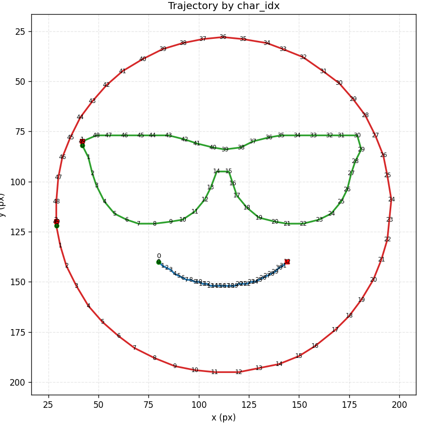
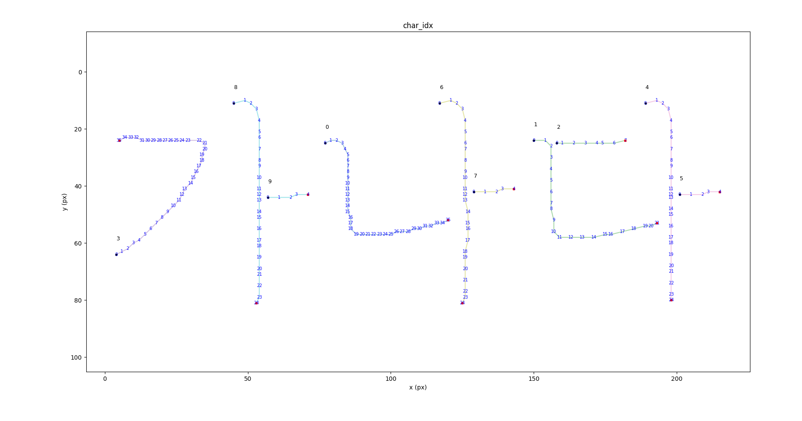
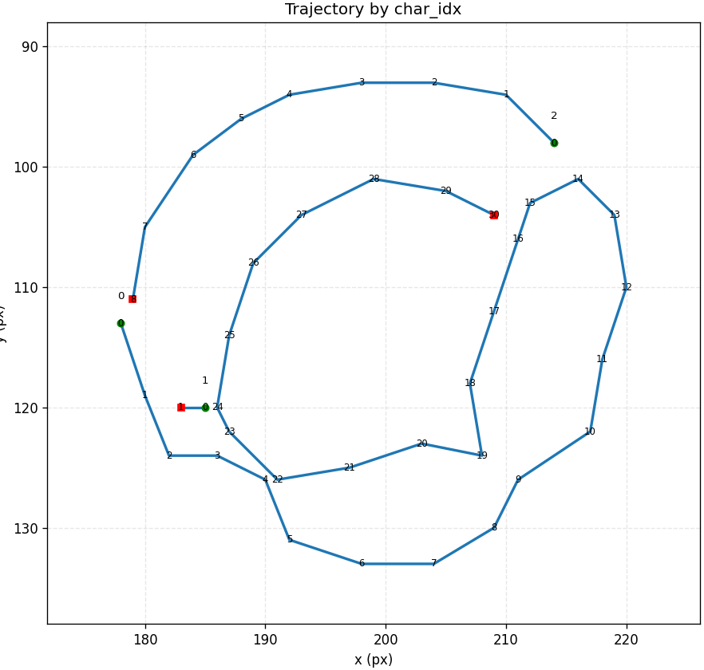

<div align="left">


</div>

# 🧠 Multi-Character Trajectory Extractor(final_project)

> 문자의 중심선을 따라 등간격 3D trajectory를 추출하는 skeleton 기반 경량 파이프라인

## 🔍 프로젝트 소개

이 프로젝트는 이미지에 포함된 **여러 개의 문자 또는 기호**에 대해 각 문자마다 중심선을 추출하고, 이를 기반으로 **(x, y, z)** 형태의 **등간격 trajectory**를 생성하는 Python 기반 모듈입니다.

- **글자를 쓰는 로봇**, **도미노 경로 설계**, **필기 재현 로봇**, **필압 기반 필기 분석** 등에 적용 가능
- ROS2, MoveIt2, GAN 기반 보간기 등 다양한 외부 시스템과 통합 가능

---

## 🗂️ 디렉토리 구조

```
project_root/
├── extractor/                         # 주요 처리 로직 모듈
│   ├── multi_character_extractor.py  # 전체 파이프라인 클래스
│   ├── image_preprocessor.py         # 이진화 및 skeleton 추출
│   ├── contour_extractor.py          # contour 기반 문자 분리
│   ├── trajectory_builder.py         # skeleton → 경로 + z-profile
│   ├── resampler.py                  # 경로 보간 및 분할
│   └── utils.py                      # 후처리 및 보조 함수
│
├── df_vis.py                         # 시각화 및 디버깅용 스크립트
├── images/                           # 테스트 이미지 폴더
└── README.md                         # 이 파일
```

---

## 🚀 설치 및 실행 방법

### 1. 설치 환경 (Python 3.10 이상)

```bash
pip install numpy opencv-python scikit-image pandas matplotlib
```

### 2. 이미지 추출 실행

```bash
python extractor/multi_character_extractor.py ./images/sample.png
```

### 3. 결과 시각화(분석용)

```bash
python df_vis.py  # 내부에서 MultiCharacterTrajectoryExtractor 사용
```

---

## 4. 파라미터 튜닝

<table>
  <tr>
    <th><b>입력</b></th>
    <th></th>
    <th></th>
    <th>"가나다"</th>
    <th>"@"</th>
    <th>"&"</th>
  </tr>
  <tr>
    <td rowspan="2"><b>파라미터</b></td>
    <td align="center">선두께</td>
    <td align="center">3</td>
    <td align="center">5</td>
    <td align="center">3</td>
    <td align="center">3</td>
  </tr>
  <tr>
    <td align="center">샘플링</td>
    <td align="center">30</td>
    <td align="center">40</td>
    <td align="center">50</td>
    <td align="center">60</td>
  </tr>
  <tr>
    <td><b>결과</b></td>
    <td></td>
    <td></td>
    <td></td>
    <td></td>
    <td></td>
  </tr>
</table>

---

## 🧠 알고리즘 구조

### 🔸 전체 파이프라인

```
[Grayscale 이미지]
   → [Otsu 이진화]
   → [Contour 기반 문자 분리]
   → [Skeleton 추출]
   → [DFS 기반 path 추출]
   → [Point 필터링 + 방향 정렬]
   → [Z-profile 계산 (두께 기반)]
   → [DataFrame 구성 → resample → 최종 trajectory 반환]
```

### 🔸 Z-profile 이란?

- 각 중심선 점마다 상하좌우로 두께를 측정하여 z 값으로 정규화
- 붓글씨 두께 재현, 필압 기반 동작 구현 등에 유용

---

## 🧩 주요 클래스 및 함수 설명

| 파일                             | 구성요소                                            | 설명                                  |
| ------------------------------ | ----------------------------------------------- | ----------------------------------- |
| `multi_character_extractor.py` | `MultiCharacterTrajectoryExtractor`             | 전체 파이프라인 총괄 클래스                     |
| `image_preprocessor.py`        | `binarize`, `extract_skeleton_from_mask`        | 전처리 및 중심선 추출 (stroke/skeletonize 등) |
| `contour_extractor.py`         | `CharacterContourExtractor`                     | 문자 단위 이진 마스크 생성                     |
| `trajectory_builder.py`        | `TrajectoryBuilder`, `PathAnalyzer`             | 중심선 → 경로 + 두께 기반 Z 생성               |
| `resampler.py`                 | `resample_path()`                               | 등간격 보간 및 max\_gap 기준 경로 분리          |
| `utils.py`                     | `filter_nearby_points`, `get_local_thickness` 등 | 경로 필터링 및 보조 기능                      |

---

## 🤖 활용 사례

- ✍️ 필기 재현 로봇
- 🎮 게임 입력 재현
- 🤖 도미노 시뮬레이션 자동 생성
- 🧑‍🏫 OCR 전처리 및 텍스트 디스플레이 벡터화
- 🧵 패브릭 레이아웃 설계용 벡터 변환

---

## 💡 개발자 가이드

- `stroke` 모드를 사용하면 글자 획을 보다 직관적으로 재현 가능
- `min_dist`, `max_gap`, `n_points`는 유연하게 실험해볼 수 있는 하이퍼파라미터
- 추가로 SVG 변환기, Bezier 보간기, ROS2 연동기, JSON exporter 등을 확장 가능

---

## 🙋‍♂️ 작성자

**재성 배 (JaeSeong Bae)**\
Vision & Robotics Engineer\
AI Engineer  
GitHub: [@jsbae-RL](https://github.com/jsbae-RL)

## 👥 Contributors

이 프로젝트는 아래의 훌륭한 분들의 협업과 기여로 완성되었습니다:

<table>
  <tr>
    <td align="center">
      <a href="https://github.com/jsbae-RL">
        <br />
        <sub><b>jsbae-RL</b></sub>
        </a><br />
        <sub>알고리즘 설계 및 기술 구현</sub>
      </a>
    </td>
    <td align="center">
      <a href="https://github.com/yujin114">
        <br />
        <sub><b>yujin</b></sub>
        </a><br />
        <sub>이미지 처리 파라미터 실험 및 성능 최적화</sub>
      </a>
      <td align="center">
      <a href="https://github.com/weedmo">
        <br />
        <sub><b>weedmo</b></sub>
        </a><br />
        <sub>경로 및 샘플링 기법 최적화</sub>
      </a>
    </td>